# Single-Cell RNA-seq Analysis of Glioblastoma

---

# Project Overview

This project presents a complete **single-cell RNA-seq analysis workflow of glioblastoma (GBM)** performed using **R, Seurat, STARsolo, and inferCNV**.

The aim of the project was to characterize the cellular composition of glioblastoma samples, identify transcriptionally distinct cell populations, annotate major cell types, compare their representation across samples, and investigate large-scale copy-number variation (CNV) patterns using inferCNV.

The workflow includes:

- Raw FASTQ quality control
- RNA-seq preprocessing
- Alignment and gene quantification using STARsolo
- Seurat-based quality control
- Cell filtering
- Normalization
- Dimensionality reduction
- PCA
- UMAP
- Clustering
- Marker gene identification
- Marker validation
- Cell-type annotation
- Sample composition analysis
- CNV input preparation
- Reference population selection
- Reference matrix validation
- inferCNV analysis
- Validation of cells included in the inferCNV analysis

---

# Biological Question

**What cellular populations are present in glioblastoma samples, how do their proportions differ between samples, and can single-cell transcriptomic data be used to investigate large-scale copy-number variation patterns?**

---

# Dataset

The project uses publicly available single-cell RNA-seq data from three glioblastoma samples.

**Organism:** *Homo sapiens*

**Data type:** Single-cell RNA-seq

**Samples:**

- SRR10353960
- SRR10353961
- SRR10353962

**Total number of cells:** 13,632

**Reference annotation:** GENCODE v47

**Main analysis framework:** Seurat

**CNV analysis:** inferCNV

The three samples contain:

- SRR10353960 — 4,791 cells
- SRR10353961 — 4,652 cells
- SRR10353962 — 4,189 cells

---

# Analysis Pipeline

Raw FASTQ files

↓

FastQC

↓

MultiQC

↓

STARsolo

↓

Gene-count matrix

↓

Seurat object

↓

Quality Control

↓

Cell filtering

↓

Normalization

↓

PCA

↓

UMAP

↓

Clustering

↓

Marker identification

↓

Marker validation

↓

Cell-type annotation

↓

Sample composition

↓

CNV input preparation

↓

Reference population selection

↓

Reference matrix validation

↓

inferCNV

↓

inferCNV result validation

---

# Bioinformatics Workflow

## 1. Raw Data and Quality Control

The workflow starts with raw single-cell RNA-seq FASTQ files.

Initial quality assessment is performed using **FastQC**, followed by a summary of quality metrics using **MultiQC**.

The quality-control stage evaluates sequencing quality and provides an overview of the input data before downstream processing.

---

## 2. Alignment and Quantification

Reads are processed using **STARsolo**.

STARsolo performs:

- Read alignment
- Cell barcode processing
- UMI processing
- Gene-level quantification

The resulting gene-by-cell count matrix is used as input for downstream analysis with Seurat.

---

# Seurat Analysis

## 3. Quality Control

The generated count matrix is imported into Seurat.

Cell-level quality metrics are calculated, including:

- Number of detected genes
- Total RNA counts
- Mitochondrial RNA percentage

Quality-control plots are generated to evaluate the distribution of these metrics and identify low-quality cells.

### QC Before Filtering

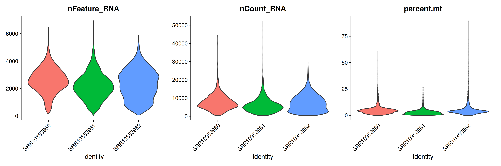

### QC After Filtering

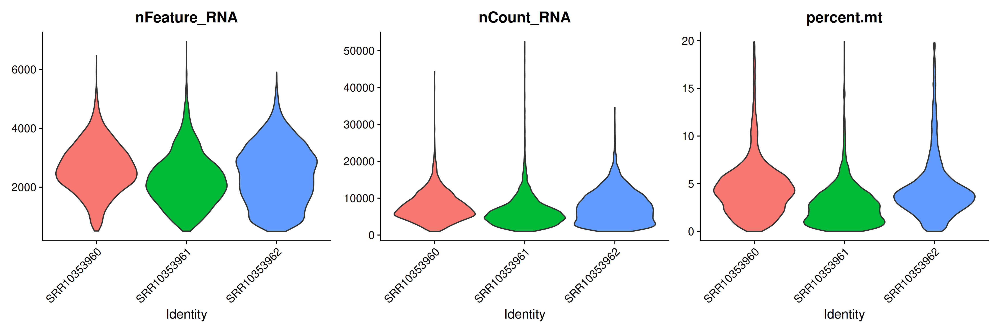

---

## 4. Cell Filtering

Cells with low-quality transcriptomic profiles are removed according to predefined quality-control criteria.

The resulting filtered dataset is used for downstream normalization and dimensionality reduction.

---

## 5. Normalization

Gene expression data are normalized using the Seurat workflow.

Highly variable genes are identified and used for downstream dimensionality reduction.

---

## 6. Principal Component Analysis

Principal Component Analysis (PCA) is performed to reduce the dimensionality of the expression matrix.

PCA provides a representation of the major sources of variation in the dataset and forms the basis for subsequent clustering and UMAP visualization.

### Elbow Plot

### PCA by Sample

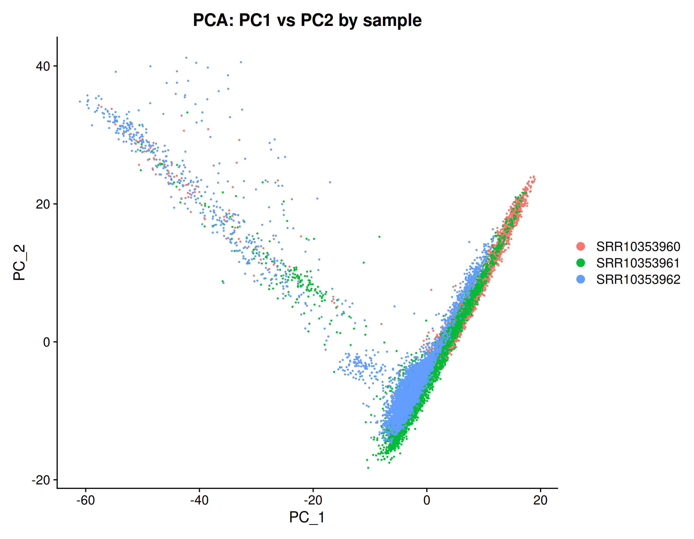

---

## 7. UMAP and Clustering

The PCA representation is used to construct a neighborhood graph and identify transcriptionally distinct cell populations.

UMAP is then used to visualize the cellular landscape in two dimensions.

The resulting clusters represent groups of cells with similar transcriptional profiles.

### UMAP Clusters

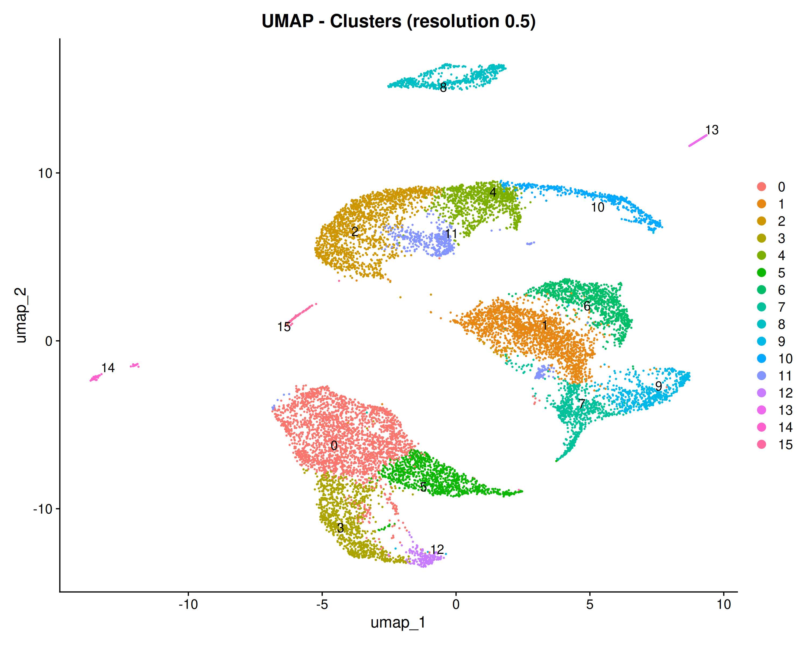

### UMAP by Sample

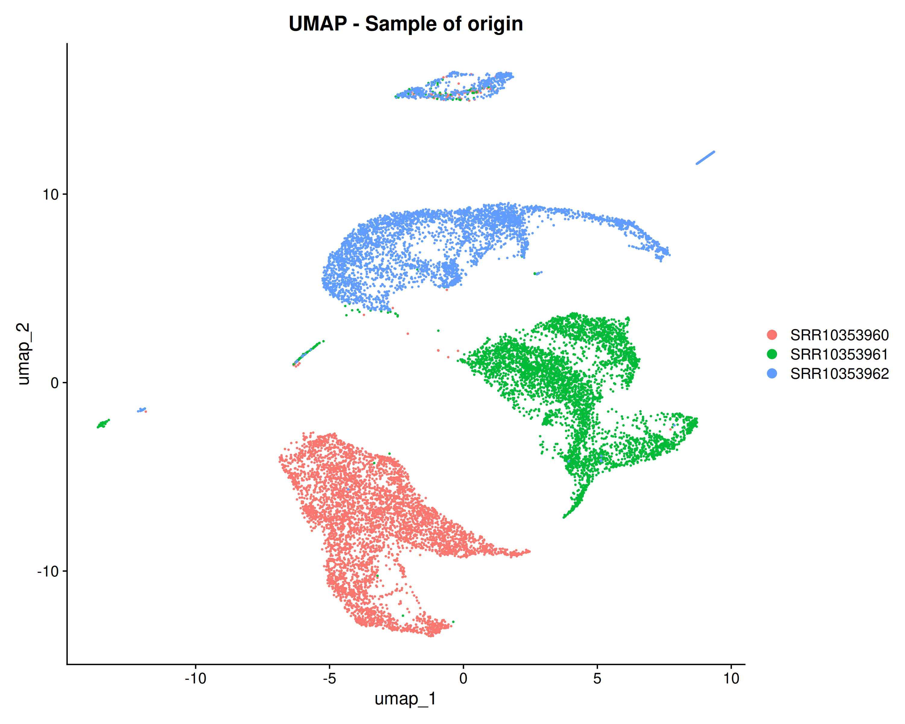

### UMAP Split by Sample

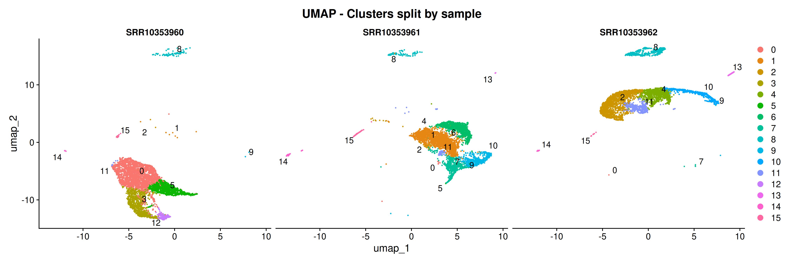

---

# Marker Gene Analysis

Differential marker analysis is performed to identify genes characteristic of individual clusters.

Marker genes are used to investigate the biological identity of the transcriptionally defined populations.

Marker validation is subsequently performed using canonical marker genes and cell-type-specific expression patterns.

### Cluster Marker Heatmap

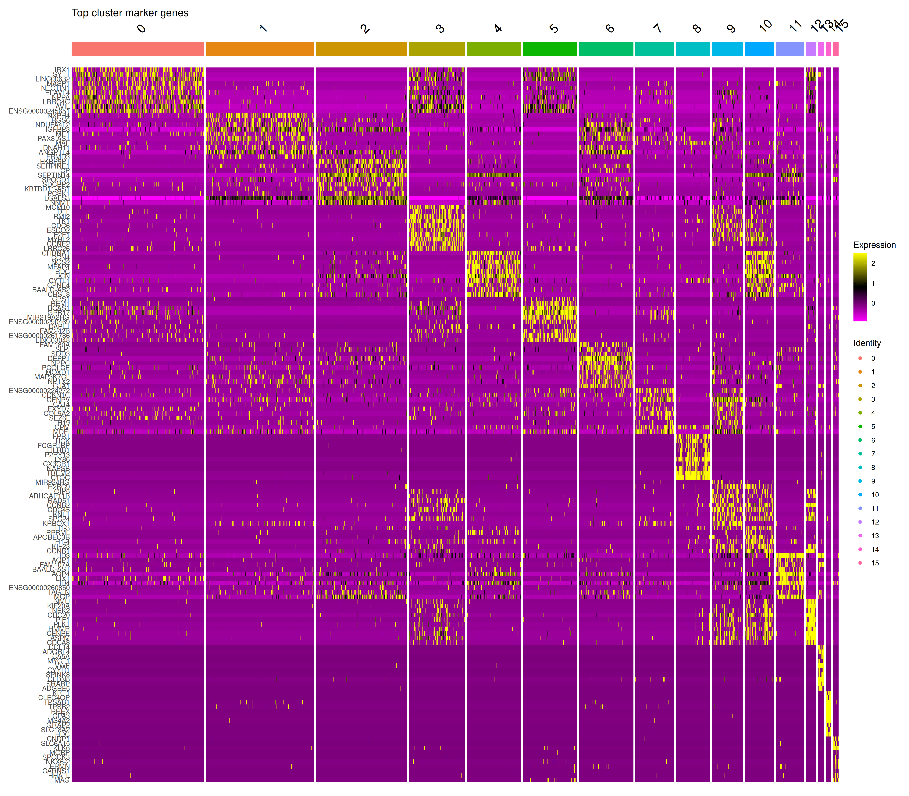

### Canonical Cell-Type Markers

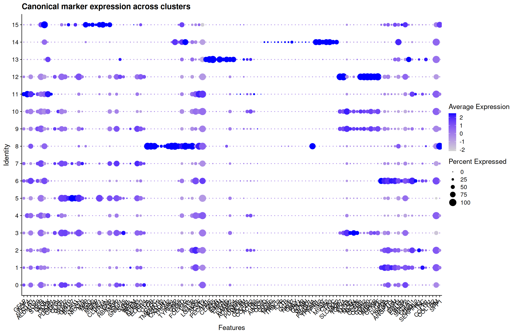

### Marker Scores

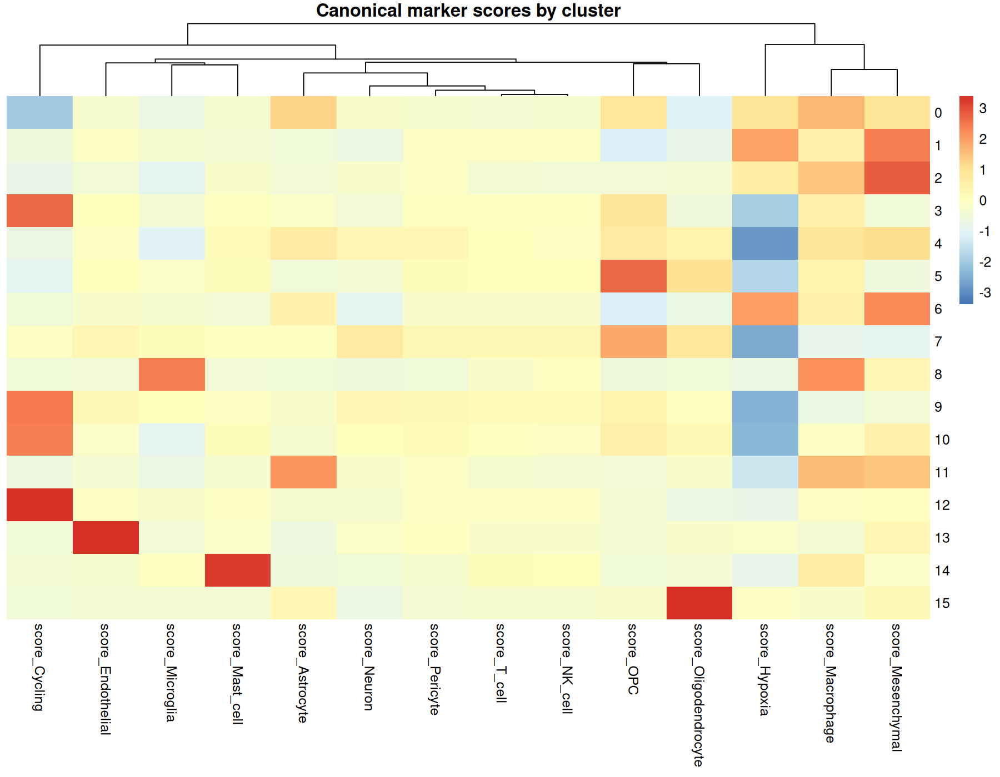

---

# Cell-Type Annotation

Cell populations are annotated using marker-gene expression and predefined cell-type scores.

The final annotation includes:

- Neural-like
- Neural-like-mixed
- Astrocyte-like
- Oligodendrocyte
- OPC-like
- OPC-Neural-like
- Microglia-Macrophage
- Endothelial
- Mast-cell
- Mesenchymal-like
- Hypoxic-Mesenchymal-like
- Vascular-Mesenchymal-like
- Cycling-S-phase
- Cycling-G2M
- Cycling-Mixed
- Highly-Cycling

### Cell-Type Annotation

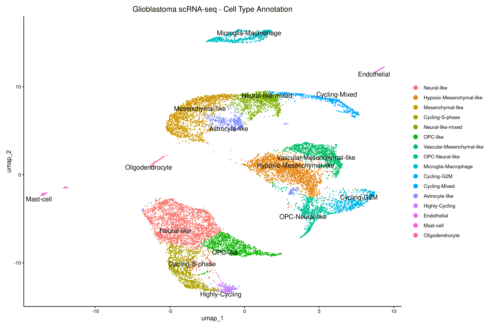

---

# Sample Composition

The cellular composition of the three samples is compared to determine how different populations are represented across the dataset.

The analysis includes both absolute cell counts and relative cell proportions.

### Cell Composition

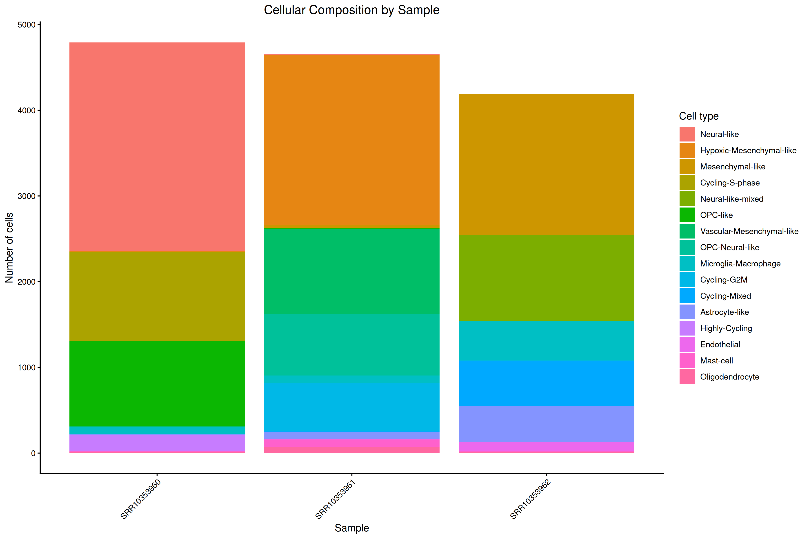

### Cell Composition by Percentage

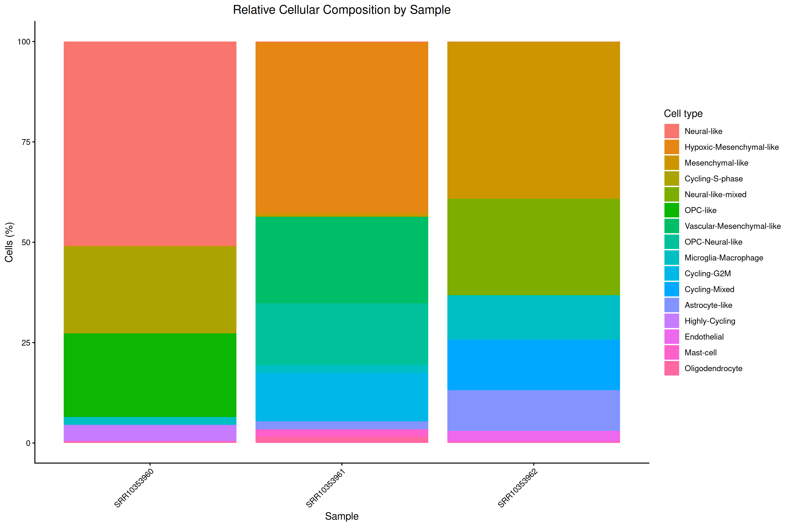

### Cell Composition Heatmap

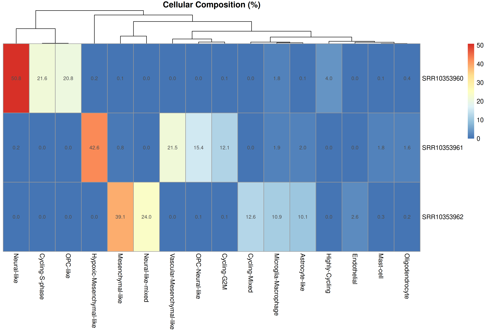

The analysis demonstrates differences in the representation of specific cellular populations between the three samples.

---

# CNV Analysis

A separate CNV analysis workflow was developed to investigate large-scale transcriptional patterns associated with copy-number variation.

Because normal reference cells are required for inferCNV analysis, candidate non-malignant populations were evaluated before CNV inference.

---

## CNV Reference Selection

Candidate reference populations were evaluated based on their expected non-malignant identity.

The selected reference populations were:

- Microglia-Macrophage
- Oligodendrocyte

A balanced reference set of **300 cells** was selected.

Reference cells by sample:

- SRR10353960 — 100 cells
- SRR10353961 — 100 cells
- SRR10353962 — 100 cells

The selected reference population consisted of:

- Microglia-Macrophage — 236 cells
- Oligodendrocyte — 64 cells

The reference matrix was subsequently validated for:

- Cell identifier consistency
- Cell order
- Gene identifier consistency
- Gene order
- Count validity
- Sample balance
- Reference population composition

All validation steps passed.

---

# inferCNV Analysis

CNV inference was performed using **inferCNV 1.18.1**.

The analysis used:

- 13,632 cells
- GENCODE v47 gene annotation
- 300 reference cells
- 13,332 observation cells
- Three independent samples

The inferCNV workflow included:

1. Gene-order preparation
2. Cell annotation
3. Reference-cell assignment
4. Count matrix preparation
5. Normalization
6. Smoothing
7. CNV signal estimation
8. Quantitative inspection of the resulting CNV profiles

The analysis was performed in sample-aware mode with denoising enabled.

---

# inferCNV Validation

The inferCNV results were subsequently inspected and validated against the original single-cell metadata.

The validation confirmed:

- Correct cell identifier alignment
- Correct cell order
- Successful matching to the original metadata
- Representation of all three samples
- Representation of multiple annotated cell types
- Successful separation of reference and observation cells

The observation cells represented approximately 2% of the original cells from each sample in the inspected inferCNV result.

The current CNV analysis is treated as an **exploratory CNV signal analysis**.

Importantly, the current workflow does **not** classify cells as malignant or non-malignant solely on the basis of inferCNV signal.

---

# Main Findings

The single-cell analysis identified a heterogeneous cellular landscape characteristic of glioblastoma.

The dataset contains multiple transcriptionally distinct populations representing:

- Neural and glial populations
- Oligodendrocyte-lineage populations
- Immune populations
- Endothelial populations
- Mesenchymal populations
- Cycling populations

The relative abundance of these populations differs between the three analyzed samples.

The Seurat analysis provides a transcriptional characterization of the GBM cellular environment, while the inferCNV workflow establishes a framework for investigating large-scale CNV-associated expression patterns.

---

# Technologies

- R
- Seurat
- SeuratObject
- STARsolo
- FastQC
- MultiQC
- inferCNV
- Matrix
- ggplot2
- pheatmap
- dplyr
- Bioconductor
- GENCODE

---

# Skills Demonstrated

This project demonstrates practical experience with:

- Single-cell RNA-seq analysis
- FASTQ quality control
- STARsolo
- UMI-based gene quantification
- Seurat
- Single-cell quality control
- Data filtering
- Normalization
- Highly variable gene analysis
- PCA
- UMAP
- Graph-based clustering
- Differential marker analysis
- Marker validation
- Cell-type annotation
- Sample composition analysis
- CNV analysis
- inferCNV
- Reference population selection
- CNV input validation
- Reproducible bioinformatics workflows
- Linux / WSL
- R scripting
- Git & GitHub project organization

---

# Repository Structure

03_SingleCell-RNAseq-Glioblastoma-Seurat/

├── data/

│   ├── counts/

│   ├── metadata/

│   ├── raw_fastq/

│   └── reference/

├── docs/

├── figures/

│   ├── QC_before_filtering.png

│   ├── QC_after_filtering.png

│   ├── QC_nCount_vs_nFeature.png

│   ├── PCA_ElbowPlot.png

│   ├── PCA_PC1_PC2_by_sample.png

│   ├── UMAP_clusters.png

│   ├── UMAP_by_sample.png

│   ├── UMAP_clusters_split_by_sample.png

│   ├── cluster_marker_heatmap.png

│   ├── CanonicalMarkers_DotPlot.png

│   ├── MarkerScores_by_cluster_heatmap.png

│   ├── UMAP_cell_type_annotation.png

│   ├── Cell_Composition_Counts.png

│   ├── Cell_Composition_Percent.png

│   └── Cell_Composition_Heatmap.png

├── logs/

├── results/

│   ├── fastqc/

│   ├── multiqc/

│   ├── starsolo/

│   ├── seurat_qc/

│   ├── seurat_filter/

│   ├── seurat_normalization/

│   ├── seurat_pca/

│   ├── seurat_clustering/

│   ├── seurat_markers/

│   ├── seurat_marker_validation/

│   ├── seurat_annotation/

│   ├── sample_composition/

│   ├── cnv_annotation/

│   ├── cnv_input/

│   ├── cnv_reference/

│   └── infercnv/

├── scripts/

│   ├── 01_download_fastq.sh

│   ├── 02_fastqc.sh

│   ├── 03_multiqc.sh

│   ├── 04_download_reference.sh

│   ├── 05_download_star_index.sh

│   ├── 06_download_whitelist.sh

│   ├── 07_starsolo.sh

│   ├── 08_seurat_qc.R

│   ├── 09_seurat_filter.R

│   ├── 10_seurat_normalization.R

│   ├── 11_seurat_pca.R

│   ├── 12_seurat_clustering_umap.R

│   ├── 13_seurat_markers.R

│   ├── 14_seurat_marker_validation.R

│   ├── 15_seurat_annotation.R

│   ├── 16_sample_composition.R

│   ├── 17_prepare_cnv_annotation.R

│   ├── 18_prepare_cnv_input.R

│   ├── 19_validate_cnv_input.R

│   ├── 20_prepare_cnv_counts.R

│   ├── 21_validate_cnv_reference.R

│   ├── 22_select_cnv_reference.R

│   ├── 23_validate_selected_cnv_reference.R

│   ├── 24_run_infercnv.R

│   ├── 25_inspect_infercnv_results.R

│   └── 26_validate_infercnv_observations.R

├── .gitignore

├── 03_SingleCell-RNAseq-Glioblastoma-Seurat.Rproj

└── README.md

---

# Reproducibility

The complete workflow is divided into independent scripts representing individual analysis stages.

Each stage generates output files that can be used by subsequent steps.

The project was developed and tested under **Ubuntu/WSL2**.

The workflow is designed to make the analysis reproducible and to allow individual stages to be inspected independently.

---

# Future Improvements

Possible extensions of this project include:

- Deeper CNV interpretation
- Chromosome-level CNV visualization
- Comparison of CNV patterns between cellular populations
- Integration with additional GBM datasets
- Validation of CNV-associated populations using independent evidence
- Integration of CNV results with marker-gene expression
- Subclonal analysis
- Automated reporting
- Conversion of the workflow into a Snakemake or Nextflow pipeline

---

# Author

**Katarzyna Zielińska**

Bioinformatics Portfolio

2026

Created as part of a Bioinformatics Portfolio project focused on RNA-seq data analysis using R and Linux.
